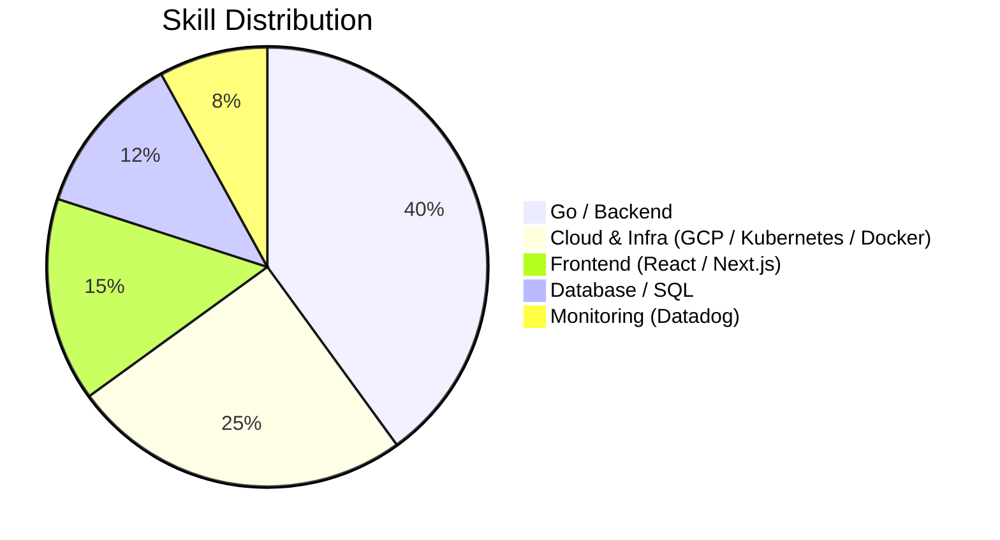

### Hi there 👋

Go を中心としたバックエンドエンジニアです。
要件定義から設計・実装・デプロイ・運用監視までを一貫して担当しています。

参画時に唯一のバックエンドエンジニアとして技術選定とアーキテクチャ設計を担当した案件も複数あり、
裁量の大きい環境で自走して進める働き方を得意としています。

---

## 🛠 Skills

---

## 🧰 Tech Stack

**Backend**

**Frontend**

**Cloud / Infra**

**Database**

---

## 📌 Currently

- 🔭 **Working on** — 株式データのシグナル分析・ポートフォリオ構築パイプライン
- 🌱 **Learning** — Rust / Solidity（静的型付け言語での設計経験を土台にキャッチアップ中）
- ⚡ **Interested in** — システムトレード、定量分析

---

<!--
GitHub のコミット統計カードについて

以前ここで使っていた公開インスタンス（github-readme-stats.vercel.app）は
無料枠の負荷超過により停止しており（HTTP 503 / DEPLOYMENT_PAUSED）、
画像が読み込めず表示が崩れる原因になっていたため一旦外している。

復活させる場合は https://github.com/anuraghazra/github-readme-stats を
自分の Vercel アカウントへデプロイし、下記の <自分の> を差し替えて有効化する。
共有インスタンスを直接参照すると同じ理由で再び壊れるため非推奨。

<a href="https://github.com/anuraghazra/github-readme-stats">
  .vercel.app/api?username=itomofumi&count_private=true&theme=gotham" />
</a>
-->
